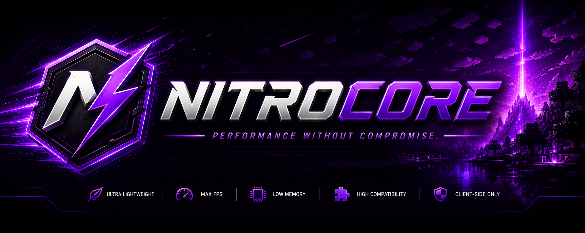

<div align="center">



# NitroCore

### ⚡ Performance Without Compromise.

*A modern optimization engine for Minecraft Forge 1.7.10.*


</div>

---

# 🚀 About

NitroCore is a next-generation optimization engine built specifically for Minecraft Forge 1.7.10.

Instead of applying isolated tweaks, NitroCore restructures the client rendering pipeline to eliminate unnecessary work, dramatically improving frame rate and reducing memory usage while remaining compatible with large modpacks.

---

# ✨ Features

- 🚀 Particle Optimizer
- 🌧 Weather Optimizer
- ☁ Cloud Optimizer
- 🔥 Animation Optimizer
- 🎨 Render Optimizer
- 📦 Chunk Optimizer
- 👤 Entity Optimizer
- 🧠 Memory Optimizer
- ⚙ Smart Optimization Profiles
- 🧩 High Mod Compatibility

---

# 🎯 Goals

- Increase FPS
- Reduce RAM usage
- Improve frame stability
- Zero server installation
- Maximum compatibility
- Easy configuration

---

# 📊 Roadmap

| Feature | Status |
|---------|--------|
| Project Setup | ✅ |
| Mixin Loader | 🚧 |
| Particle Optimizer | ⏳ |
| Weather Optimizer | ⏳ |
| Render Optimizer | ⏳ |
| Memory Optimizer | ⏳ |
| Benchmark System | ⏳ |

---

# 📦 Installation

Download the latest release.

Place it inside:

```text
mods/
```

Launch Minecraft.

Done.

---

# ❤️ Credits

Created by **PowerKup**

Built with

- Minecraft Forge
- RetroFuturaGradle
- GTNH Convention Plugin
- UniMixins

---

# 📜 License

MIT License
